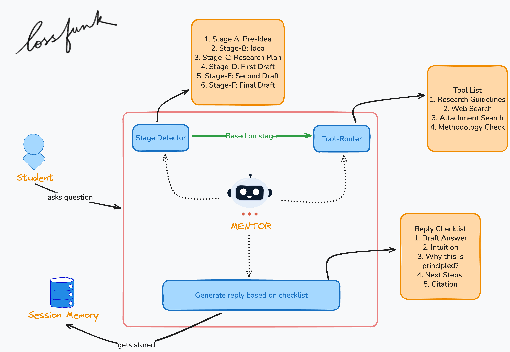

# METIS: Mentoring Engine for Thoughtful Inquiry & Solutions

Code and evaluation artifacts for the preprint **“METIS: Mentoring Engine for Thoughtful Inquiry & Solutions”**.


## Abstract
Many students lack access to expert research mentorship. We ask whether an AI mentor can move undergraduates from an idea to a paper. We build **METIS**, a tool‑augmented, stage‑aware assistant with literature search, curated guidelines, methodology checks, and memory. We evaluate METIS against GPT‑5 and Claude Sonnet 4.5 across six writing stages using LLM‑as‑a‑judge pairwise preferences, student‑persona rubrics, short multi‑turn tutoring, and evidence/compliance checks.

## System overview



## Key results


## Installation
```bash
uv sync
```

## Environment
```bash
cp .example.env .env
```

Required (at least one):
- `OPENROUTER_API_KEY` (recommended)
- `OPENAI_API_KEY`

Optional (enables additional retrieval providers):
- `TAVILY_API_KEY`

## Run METIS (CLI)
```bash
uv run arm
```

## Reproduce evaluation runs

Run the stage A/B/C evaluation driver (writes a combined summary to `reports/evals/latest_run.json`):

```bash
uv run python evaluation/scripts/run_all_stages.py
```

Artifacts are written under:
- `evaluation/results/raw_logs/`
- `evaluation/results/analysis_reports/`

## Citation
If you use this code or evaluation setup, please cite the preprint:

```bibtex
@misc{metis2026,
  title        = {METIS: Mentoring Engine for Thoughtful Inquiry \& Solutions},
  author       = {Kumar, Abhinav Rajeev and Trehan, Dhruv and Chopra, Paras},
  year         = {2026},
  note         = {Preprint. Repository: https://github.com/lossfunk/ai-research-mentor}
}
```
